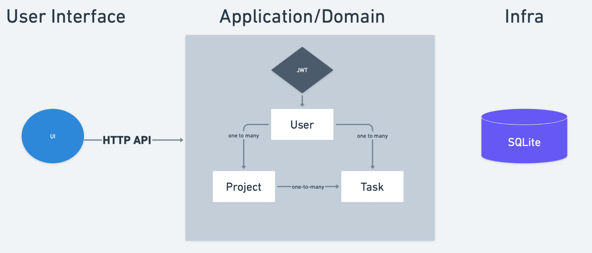
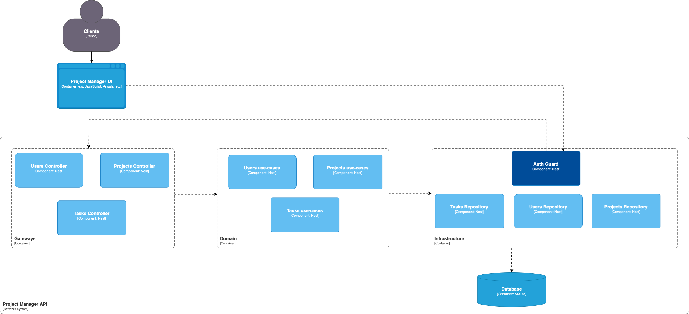
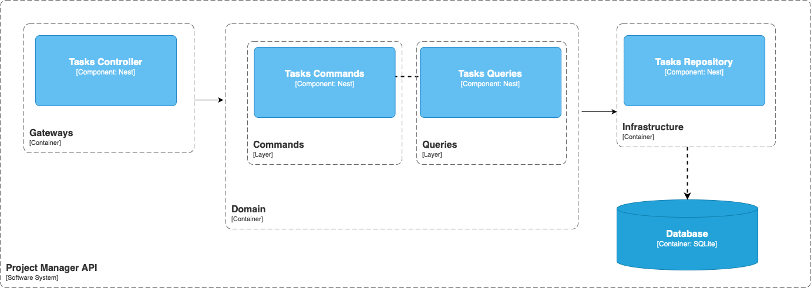

# Project Manager API

Task management project developed as part of the **Node.js Platform** course, from the **Distributed Software Architecture** postgraduate program at **PUC Minas**, taught by Professor **Samuel Martins**.

---

## 🚀 Business Rules

The application consists of a project and task management system with the following guidelines:

1.  **Users**: User registration and authentication for system access.
2.  **Projects**: Users can create and manage projects.
3.  **Tasks**: Management of tasks linked to specific projects.
4.  **Microservices**: The application is divided into two main services:
    -   **Project Manager API**: Manages users, authentication, and projects.
    -   **Tasks Service**: Microservice dedicated to task management, communicating via Pub/Sub (Redis) with the main service.

### High-Level Architecture


### C4 Models

#### Context System


#### Tasks Microservice


---

## 🏗️ Project Structure and Clean Architecture

The project uses the **Monorepo** model and follows **Clean Architecture** principles to ensure decoupling and testability.

### Folder Organization

-   `apps/`: Contains the application's microservices.
    -   `project-manager-api/`: Main service (API Gateway / Core).
    -   `tasks/`: Service specialized in tasks.
-   `libs/common/`: Library for shared code between services.
-   `docs/`: Documentation, diagrams, and Postman files.

### Clean Architecture Layers (within each app)

The structure inside `src` follows the layer division:

1.  **Domain**: The heart of the application. Contains business entities, interfaces (contracts), and Use Cases (`use-cases`). It does not depend on external frameworks.
2.  **Gateways**: Input and output interfaces, adapting data for the domain layer.
3.  **Infrastructure**: Concrete implementations of external frameworks and tools, such as:
    -   `database`: TypeORM repositories and SQLite configurations.
    -   `auth`: JWT authentication strategies.
    -   `redis`: Messaging configurations for communication between microservices.

---

## 🛠️ How to Run the Project

### Prerequisites
-   [Node.js](https://nodejs.org/) (LTS version recommended)
-   [Docker](https://www.docker.com/) (for Redis)

### 1. Install Dependencies
In the project root directory, run:
```bash
npm install
```

### 2. Start the Database and Support Services (Redis)
The project uses Redis for communication between microservices. From the project root directory, start the container using Docker Compose:
```bash
docker-compose up -d
```
*Note: The SQLite database will be created automatically on the first execution.*

### 3. Run the Application
To run both services simultaneously in development mode:
```bash
npm run dev:debug-all
```

Or individually:
```bash
# Main Service
npm run start:debug-project-manager

# Tasks Service
npm run start:debug-tasks
```

### 📖 Access Swagger
With the application running, the API documentation can be accessed at:
[http://localhost:3000/docs](http://localhost:3000/docs)

---

## 📮 Postman
Ready-to-test requests can be imported through the file below:

🔗 [Download Postman Collection](docs/project-manager-api.postman.json)